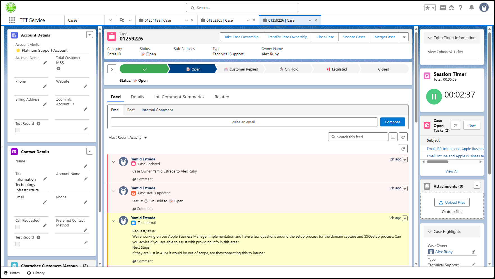

# Apply custom CSS to Salesforce Case View  

1. Download the Stylus browser extension and install it
   - [Stylus for Edge or Chrome](https://chromewebstore.google.com/detail/stylus/clngdbkpkpeebahjckkjfobafhncgmne?hl=en)
   - [Stylus for Firefox](https://addons.mozilla.org/en-US/firefox/addon/styl-us/)
2. Click [here](https://userstyles.world/style/22175/salesforced) to open the profile in UserStyles
3. On the UserStyles page, click **Install**
4. The Stylus extension will open. Click **Install style**

<!--
3. Click [here](SalesFORCED_stylus.json) to open the Stylus configuration
4. Click the **Download raw file** button (top right)
5. Click the **Stylus** extension icon in your browser
6. Click **Manage**
7. Click **Import**
8. Select the json file you downloaded in step 2 and click **Open**  
-->

> [!NOTE]
> Stylus will automatically update the style within 24 hours of my publishing an update. You can manually update the style by going to the Stylus extension > Manage > Check all styles for updates > Install update.  

> [!TIP]
> You can modify the values in the styles from Stylus extension > Manage page.  

> [!TIP]
> You can disable the modifications by clicking the Stylus extension while a Salesforce Case View tab is open, then unchecking the box for SalesFORCED.