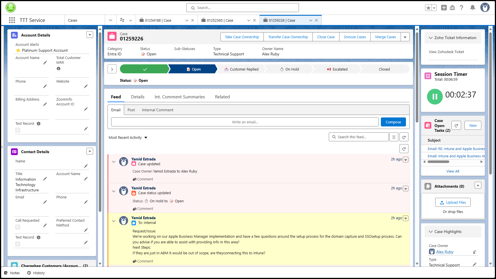

# Apply custom CSS to Salesforce Case View  
1. Download the Stylus browser extension and install it
   - [Stylus for Edge or Chrome](https://chromewebstore.google.com/detail/stylus/clngdbkpkpeebahjckkjfobafhncgmne?hl=en)
   - [Stylus for Firefox](https://addons.mozilla.org/en-US/firefox/addon/styl-us/)
2. Click [here](SalesFORCED_stylus.json) to open the Stylus configuration
3. Click the **Download raw file** button
4. Click the **Stylus** extension icon in your browser
5. Click **Manage**
6. Click **Import**
7. Select the json file you downloaded in step 2 and click **Open**  

> [!TIP]
> To disable any of the modifications, open the Stylus extension and click Manage, then un-check either of the boxes next to the SalesFORCED entries.  
  
> [!TIP]
> You can click into any of the modification to modify the values, though changing the sidebar sizes isn't as easily as it looks.

> [!NOTE]
> If you're updating to a new version of my Stylus file, Stylus will skip any entries that are already installed.  

